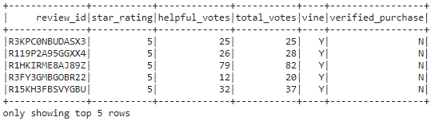
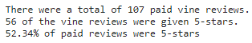
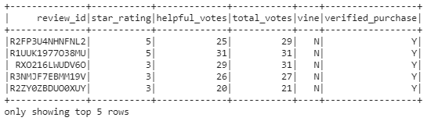
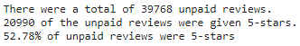

# Amazon_Vine_Analysis

## Analysis Overview

 
We are tasked with analyzing Amazon reviews written by members of the paid Amazon Vine program. The Amazon Vine program is a service that allows manufacturers and publishers to receive reviews for their products. Companies pay a small fee to Amazon and provide products to Amazon Vine members, who are then required to publish a review.
 
For this project we will be analyzing reviews from the outdoor product category. We will use PySpark to perform the ETL process and to determine if there is any bias toward favorable reviews from vine members in our dataset.  

## Analysis Results
### Paid Vine Rating Summary
Table: 
 
Summary: 
 
- There were a total of 107 paid vine reviews.
- 56 of the vine reviews were given 5-stars.
- 52.34% of paid reviews were 5-stars
 
### Unpaid Vine Rating Summary
Table: 
 
Summary: 
 
- There were a total of 39768 unpaid reviews.
- 20990 of the unpaid reviews were given 5-stars.
- 52.78% of unpaid reviews were 5-stars
 
## Summary
 
